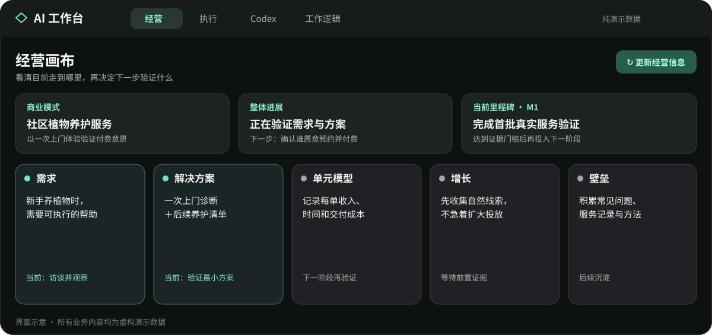
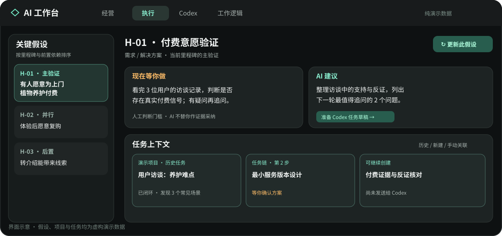
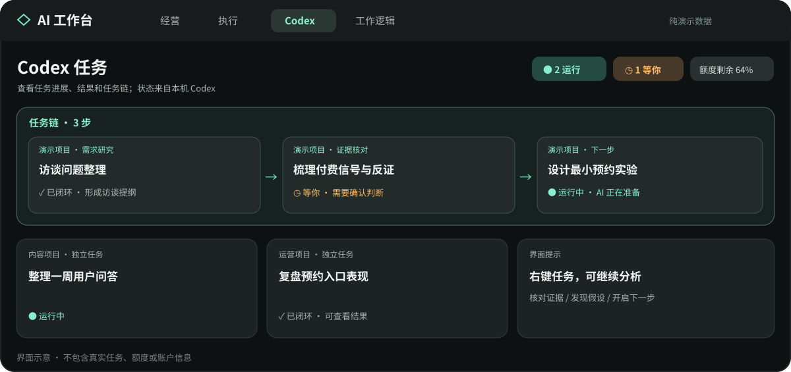

# AI 工作台 · Community

这是一个运行在 **Mac 刘海或菜单栏**的本地工作台：一边看经营方向和关键假设，一边看 Codex 任务、结果和下一步建议。它是开源的空白版本，**不带作者的商业资料、客户信息或任务记录**；首次使用时，需要填入你自己的资料。

> 先说清楚兼容范围：**当前只有 Codex 任务连接器**。你可以让 Codex、WorkBuddy 或其他能操作本机文件的 AI 帮你安装和填写资料，但工作台暂时**不会自动读取 WorkBuddy 或其他 AI 工具的任务**。没有 Codex 时，经营画布仍能用，任务监控、Codex 额度和任务草稿跳转则不可用。

## 我该走哪条路？

| 你的情况 | 从这里开始 |
| --- | --- |
| Mac 上已经装了 Codex | 看下面的「用 Codex：复制一段话开始」；这是最省事的方式。 |
| 主要使用 WorkBuddy 或其他本地 AI | 看「用 WorkBuddy 或其他 AI」；它可以帮你配置工作台，但不会自动接入自己的任务。 |
| 不想让 AI 安装，或 AI 没有本机命令权限 | 看「手动安装」；装好后仍可让 AI 帮你填写资料。 |

需要 **macOS 14 或更新版本**。安装要用到 Xcode Command Line Tools 提供的 `swift` 和 `codesign`。如果缺少这些工具，先按 AI 的提示安装，再继续。整个过程在你的 Mac 本地进行，不需要把商业资料上传到这个仓库。

## 用 Codex：复制一段话开始

1. 打开 Mac 上的 **Codex**，新建一个**本地任务**，不要选云端任务；安装 Mac 软件必须能操作这台 Mac。
2. 把下面整段话复制进任务输入框，发送。你**不必先手动克隆仓库**。
3. AI 会先检查环境和安装程序，再逐个问你业务问题。遇到你要做的经营判断，照实回答即可；不知道就说「还没验证」。

```text
请在这台 Mac 本地帮我安装和首次配置 AI 工作台：
https://github.com/zainosl/ai-workbench-community

如果仓库还没下载，请克隆到一个新的专用目录；如果本机已有这个目录或应用，先检查并复用，不要覆盖我的资料。先阅读仓库的 README.md、AGENTS.md 和 Resources/Templates，检查 macOS、swift 和 codesign 是否满足要求；如缺工具，告诉我需要做什么，完成后再继续。运行自测、执行 ./scripts/install.sh，并打开 AI Workbench Community.app。

首次启动后，一次只问我一个必要问题，帮我把真实业务信息填到应用创建的本地 Workspace 模板中。把事实、判断、待验证假设区分开；不知道的内容写「待填写/待验证」，不要编造。先向我展示简短预览，经过我确认后，才把本地 config.json 的 configured 设为 true，并让工作台重新读取。不要把我的个人资料、客户信息或日志提交到 GitHub，不要修改我电脑上其他版本的工作台。

完成时请告诉我：应用安装在哪、怎么打开、目前能看到什么、哪些功能还需要本机 Codex 任务数据。
```

安装完成后，用 **⌃⇧Space（Control + Shift + 空格）** 展开或收起工作台；展开时按 `Esc` 收起，也可以点刘海入口。外接无刘海屏会显示紧凑悬浮条。以后想让 Codex 继续修改工作台，建议把下载后的仓库文件夹添加为 **本地项目**，再从这个项目开启新任务；这样 AI 能继续读取仓库中的 `AGENTS.md`。参见 [Codex 本地项目说明](https://learn.chatgpt.com/docs/projects)。

## 用 WorkBuddy 或其他本地 AI

这条路适合想用别的 AI 帮你**安装和填写经营资料**的人。WorkBuddy 用户可新建任务，选择一个**独立的本机工作目录**，保持默认权限，再发送下面这段话。它可能会对运行脚本、访问其他目录或网络请求弹出权限确认；不需要为了省事开启「完全访问」。其他 AI 工具也可以使用这段话，前提是它能读取本机文件并运行命令。

```text
请在我的 Mac 本地安装和配置这个开源 AI 工作台：
https://github.com/zainosl/ai-workbench-community

如果仓库尚未下载，请克隆到当前工作目录里的独立文件夹；若已有文件，先检查，不要覆盖。阅读 README.md、AGENTS.md、CODEBUDDY.md 和 Resources/Templates。先检查 macOS、swift、codesign，再运行自测和 ./scripts/install.sh，启动 AI Workbench Community.app。若你没有运行本机命令的权限，请停下来给我具体的手动操作步骤，不要声称已经安装成功。

请一次问我一个业务问题，只把我的真实资料写入应用自己的本地 Workspace，先让我预览并确认，再启用本地 config.json 的 configured。不要编造证据，不要提交我的资料或日志到 GitHub。最后解释哪些页面现在可用、哪些需要我另外安装并登录 Codex；不要把 WorkBuddy 任务说成已经自动接入。
```

WorkBuddy 的工作目录和默认权限由它自己的任务设置控制，参见 [WorkBuddy 新建任务](https://www.workbuddy.ai/docs/workbuddy/Create-Task)与[权限模式](https://www.workbuddy.ai/docs/workbuddy/From-Beginner-to-Expert-Guide/Function-Description/Permission-Modes)。如果只想通过 WorkBuddy 帮忙整理资料，不想安装 Codex，也可以使用工作台的经营画布；**任务页不会显示 WorkBuddy 的任务进度**。

**已经用 Codex 装过，后来换成 WorkBuddy？** 不必重新安装或搬家。让新的 AI 打开同一个本地源码目录，阅读 `README.md` 和 `AGENTS.md`；告诉它你要修改什么，并明确授权它读取 `~/Library/Application Support/AIWorkbenchCommunity/` 中的哪些资料。工作台数据属于这台 Mac，不属于某个 AI 对话。换 AI 助手不会自动增加任务连接器；想显示新工具的任务，需要为该工具另外开发并验证连接器。

## 手动安装：AI 无法操作本机时

在 Mac 的「终端」里依次运行：

```bash
git clone https://github.com/zainosl/ai-workbench-community.git
cd ai-workbench-community
./scripts/install.sh
open "$HOME/Applications/AI Workbench Community.app"
```

如果你 Fork 了本项目，请把第一行地址换成你的 Fork 地址。脚本会把应用安装到 `~/Applications/AI Workbench Community.app`，不会覆盖其他名称的工作台；若已有同名开源版，会先备份旧包。首次启动后，点「打开资料目录」和「打开配置文件」，按模板填好，再把 `configured` 改为 `true`，点「我已填好，重新读取」。也可以此时把本地仓库作为 Codex/WorkBuddy 的工作目录，让 AI 按上面的要求陪你填写。

第一次打开只看到「首次设置」是正常的，不是安装失败。启用后，经营页显示你填入的内容；任务页要等本机已有 Codex 任务才会有实时任务可看。没有数据的地方会保持空白或显示不可用，不会自动生成假的进度。

## 界面示例

下面三张图按当前开源版的界面结构绘制，**全部使用虚构的业务、项目、任务和额度**，用于说明你会在各页面看到什么；它们不是某个真实账户的截图，实际内容取决于你填入的资料与本机 Codex 任务。

**经营画布**：把商业模式、整体进展、当前里程碑和五步法放在一起看。



**假设执行**：先看现在等你做什么，再看 AI 建议与这条假设关联的任务上下文。



**Codex 任务**：区分运行中、等你处理和已闭环任务；由上一步开启的任务会按任务链归在一起。



## 这个工作台到底怎么运作？

简单说，**经营资料是你维护的依据，Codex 任务是执行记录，AI 建议是待你审阅的下一步**。三者不会自动混成一份「AI 说了算」的结论。

```text
你维护的本地经营资料 ──点「更新经营」──> 五步法 / 里程碑 / 关键假设
                                                   │
                                                   ▼ 选一条假设
Codex 本地任务 ──状态轻量同步──> 任务列表 ──关联任务──> 假设的任务上下文
                                                   │
                               点「更新此假设」─────┘
                                                   ▼
                                      证据/反证、AI 建议、待审阅草稿
                                                   │
                                         你决定采纳、补证、修改或停止
                                                   │
                                经你确认后更新本地资料，形成下一轮输入
```

1. **读取**：工作台读取你本机的六份 Markdown 资料，展示五步法（需求、解决方案、单元模型、增长、壁垒）、当前里程碑与关键假设。点击「更新经营」才会重新读取经营资料。
2. **执行**：如果本机有 Codex，工作台会轻量同步任务状态和新结果，包括归档历史。你可以给某条假设粘贴 `codex://threads/<UUID>` 做精确关联；由工作台开启的下一步任务会记录父子任务链。任务信息和经营判断是两种不同的数据。
3. **学习**：点击「更新此假设」才会重新梳理这条假设相关的任务与项目资料。任务右键能创建「核对已有假设的证据与反证」或「提炼新假设」的 Codex 草稿。任务运行中的流式文字不算新结果；AI 生成的报告也**不等于**真实用户或市场证据。
4. **沉淀**：工作台可提出写回经营资料的建议，但只做待审阅草稿；由你决定写什么、何时写。它不会擅自改经营底库、发送消息或发布内容。

所以它有两种更新节奏：**Codex 任务状态与结果轻量同步**；**经营内容和单条假设判断由你主动点击更新**。工作逻辑页可以查看规则和近期事件，更完整的本机运行日志在 `Logs/`，便于回看「为什么这样建议」。

## 私人资料怎么放

首次运行生成的目录结构：

```text
~/Library/Application Support/AIWorkbenchCommunity/
├── config.json               # 名称、是否完成设置、资料目录、可选项目源
├── Workspace/
│   ├── business.md            # 商业模式与五步法
│   ├── assumptions.md         # 可证伪的关键假设
│   ├── dependencies.md        # 前置依赖
│   ├── milestone.md           # 当前业务里程碑与解锁门槛
│   ├── priorities.md          # 本轮优先假设和最小验证动作
│   └── emerging.md            # 新发现假设观察池
├── Associations/              # 任务与假设的精确关联、任务链
├── Results/                   # 已读状态
└── Logs/                      # 本地运行事件
```

`config.json` 首次生成时 `configured` 为 `false`。`workspacePath` 默认指向上述 Workspace，也可以改为你已有的本地资料目录。`projects` 可以留空；若需要为假设读取某个项目的工作资料，可按以下结构增加：

```json
{
  "id": "example-project",
  "name": "我的项目",
  "rootPath": "/绝对路径/我的项目",
  "overview": "overview.md",
  "progress": "progress.md",
  "preferences": "preferences.md",
  "assumptions": "assumptions.md",
  "result": "result.md"
}
```

相对文件名相对于 `rootPath`。项目文件可以是你的原有资料，工作台只读。不要把本机 `config.json`、Workspace、客户档案、会话、Logs 或打包后的个人数据提交到公开仓库。

## 隐私与边界

- 应用在本地读取你配置的 Markdown、Codex 本地会话/任务状态，并启动本地 Codex app-server 获取支持的账户使用信息。具体可用额度字段依 Codex 版本与账户返回而变；未提供时显示“—”。
- 开源代码与安装包不带个人资料。个人资料在 Application Support 下创建，Git 忽略本地配置和输出目录。
- AI 建议通过“创建待发送草稿”表达；要不要发送、修改资料、联系用户、发布内容或解锁资源，仍由你决定。
- 对外分享日志前请自行检查；日志可能含有你配置的项目名、任务 ID、错误描述等元数据。不要直接公开整个 Application Support 目录。
- 这是个人效率工具，不是对业务假设的自动证明系统，也不是官方 Codex/WorkBuddy 产品。

## 开发和检查

```bash
swift build
swift run AIWorkbenchCoreSelfTest
swift run AIWorkbenchNext --diagnose
```

`--diagnose` 会检查本地模板与 Codex 扫描是否可用，不会列出会话正文。源码分为 `AIWorkbenchCore`（解析、规则、日志、关系记录）和 `AIWorkbenchNext`（macOS UI、Codex 连接、本地配置）。欢迎通过 issue/PR 改进；提交前请确保补丁、测试样本和截图都不包含真实客户、密钥或私人路径。

## 常见问题

**安装脚本提示找不到 `swift`？** 运行 `xcode-select --install` 安装 Command Line Tools 后重试。

**看不到任务？** 确认 Codex 已在本机产生任务记录，点击右上角同步；纯 WorkBuddy 任务不会自动出现。

**打开后只看到首次设置？** 这是预期行为。填写六份资料后，把 `config.json` 的 `configured` 改为 `true`，在界面点击重新读取。

**任务与假设关联错了？** 在对应假设页粘贴准确的 Codex 深度链接。单靠标题匹配仅帮助查找上下文，不应视作商业证据。

MIT License。欢迎 fork 与二次开发。

相关官方资料：[Codex AGENTS.md](https://learn.chatgpt.com/docs/agent-configuration/agents-md)、[Codex App Server](https://learn.chatgpt.com/docs/app-server)、[WorkBuddy 选择工作目录与引用文件](https://www.workbuddy.ai/docs/workbuddy/Create-Task)。
